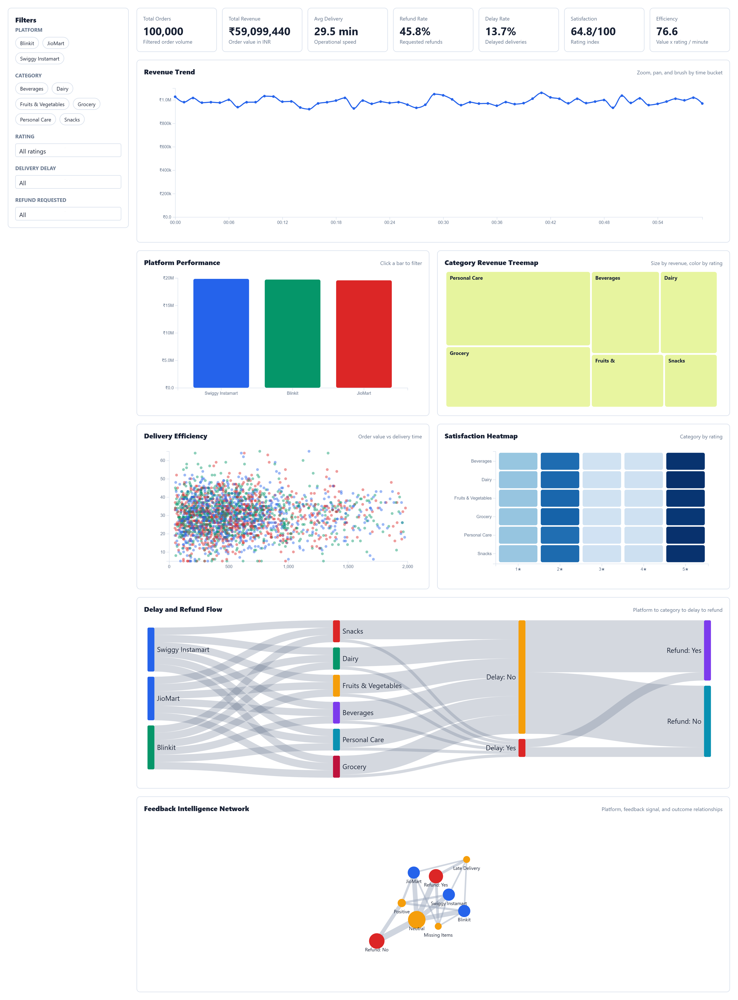

# Ecommerce Delivery Analytics Dashboard

Full D3.js + Bootstrap + Crossfilter2 + Vite dashboard for `Ecommerce_Delivery_Analytics_New.csv`.

## Features

- CSV preprocessing and derived metrics
- KPI cards
- Cross-filtering by platform, category, rating, delay, and refund
- Revenue trend with zoom and pan
- Platform bar chart
- Category treemap
- Delivery scatter plot
- Satisfaction heatmap
- Sankey flow diagram
- Feedback intelligence network graph
- Hover tooltips
- Animated transitions
- Dynamic dark mode
- Export dashboard as PNG

## Run

### Vite project

```bash
npm install
npm run dev
```

Then open the local Vite URL shown in the terminal.

### Standalone static version

Use this if Node.js/npm is not installed:

```bash
python -m http.server 8000
```

Then open:

```text
http://127.0.0.1:8000/standalone.html
```

## Dashboard Preview

<p align="center">
  
</p>

<p align="center">
  
</p>
